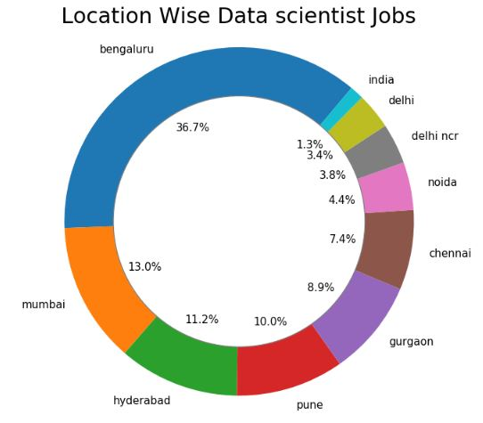
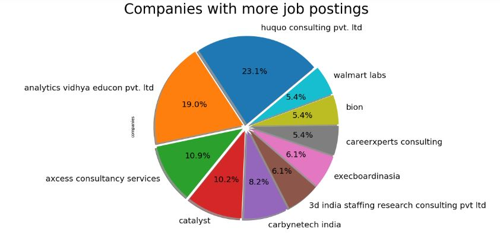

# Data-Science-Job-Trend-2020-in-India
## About
This is about the data science job trend in India. A deep analysis based on the top required skill set and vacancies. Data got scrapped from naukri.com site and 
1000 active jobs have been scraped for analysis.

## Requirements
1. Python
2. matplotlib
3. pandas
4. selenium

## Analysis Overview

  

